<!--
  ACCETRA profile README.
  Repo must be named accetra so GitHub pins it to the profile.
  Keep assets/boot.svg and assets/skills.svg next to this file, the animation lives in them.
  The Last boot line is stamped by .github/workflows/heartbeat.yml, do not edit it by hand.
-->



**Muhammad Ammad Kiyani**  
Front end developer in Islamabad, Pakistan. Open to work.


`Click a command to run it.` Every one of these also runs for real, with a live prompt, at [muhammadammadkiyani.com](https://muhammadammadkiyani.com).

<details open>
<summary><code>C:\&gt; about</code></summary>

I build interfaces that feel engineered rather than assembled. Most of my week is agency work at Constantine PR and Communications, where a brand deck on Monday turns into a shipped site by Friday. The rest goes into small machines: a terminal portfolio with no dependencies, a language model trained from scratch, a runner game with no engine under it.

Comfortable owning the whole path. Layout, motion, state, build, deploy, and the copy that holds it together.

</details>

<details>
<summary><code>C:\&gt; skills</code></summary>



Numbers are a self assessment, not a certification.

</details>

<details>
<summary><code>C:\&gt; dir projects</code></summary>

**PakLM** `pytorch`  
A small language model trained from scratch on Urdu, Roman Urdu and English code switching. Tokeniser, training loop and evaluation built rather than borrowed.

**Repo Tour Guide** `react, express, openai`  
Walks you through an unfamiliar codebase like a guided tour instead of a search box. Dual provider, so it runs against a local model or a hosted one.

**Turtle Dash** `canvas, vanilla js`  
Endless runner in the browser. No engine, no assets, no build step. [Play it](https://turtle-dash.vercel.app)

**ACCETRA terminal** `html, css, js`  
A working CRT terminal portfolio in one file. Phosphor themes, command history, tab completion, zero dependencies. [Open it](https://muhammadammadkiyani.com)

</details>

<details>
<summary><code>C:\&gt; experience</code></summary>

**Front end developer**, Constantine PR and Communications. 2024 to now.  
Web development, design, campaign work and content production across client accounts in Islamabad, Dubai and Casablanca.

**Web developer**, Syslab Technologies. 2023 to 2024.

</details>

<details>
<summary><code>C:\&gt; theme</code></summary>

The tube ships in four phosphor sets, each a real CRT type rather than a random accent pick. They swap live on the site.

[P1 green](https://muhammadammadkiyani.com/#theme%20p1) &nbsp; [P3 amber](https://muhammadammadkiyani.com/#theme%20p3) &nbsp; [P4 white](https://muhammadammadkiyani.com/#theme%20p4) &nbsp; [P7 violet](https://muhammadammadkiyani.com/#theme%20p7)

</details>

<details>
<summary><code>C:\&gt; contact</code></summary>

Reply time is usually under a day. Email is fastest.

- [ammadkiyani92@gmail.com](mailto:ammadkiyani92@gmail.com)
- [muhammadammadkiyani.com](https://muhammadammadkiyani.com)
- [linkedin.com/in/muhammadammadkiyani](https://linkedin.com/in/muhammadammadkiyani)

</details>

<details>
<summary><code>C:\&gt; neofetch</code></summary>

```
user      accetra@github
os        ACCETRA DOS 5.1
shell     profile.sys
role      Front end developer
based     Islamabad, Pakistan
stack     TypeScript, React, Astro
status    open to work
deps      0
```

</details>

<details>
<summary><code>C:\&gt; matrix</code></summary>

Rain needs a canvas, and a README does not have one. It runs on the real terminal.

[Let it rain](https://muhammadammadkiyani.com/#matrix)

</details>

<details>
<summary><code>C:\&gt; cat secrets/</code></summary>

```
Access denied. Nice try.
```

</details>

<details>
<summary><code>C:\&gt; sudo make me a maintainer</code></summary>

```
guest is not in the sudoers file.
This incident has been reported to nobody.
```

</details>

<details>
<summary><code>C:\&gt; exit</code></summary>

```
Signal lost. Thanks for stopping by.
```

</details>

<sub>Last boot <!-- boot:start -->31 Jul 2026, 04:28 PKT<!-- boot:end --></sub>
